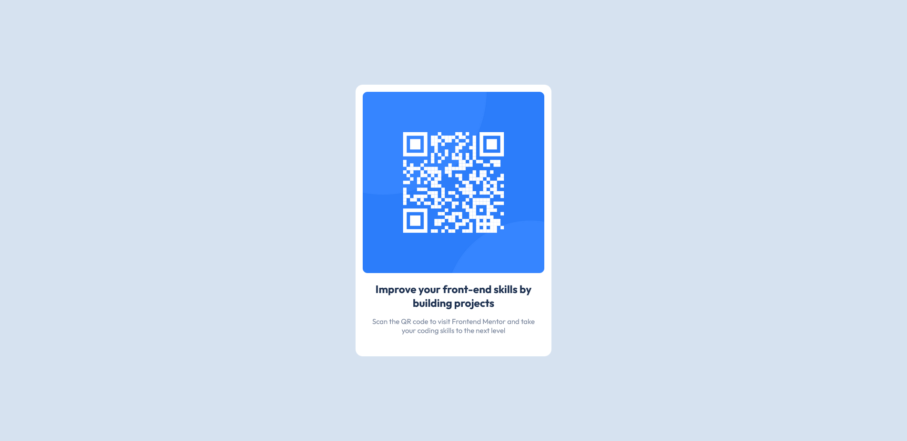

# Frontend Mentor - QR code component solution

This is a solution to the [QR code component challenge on Frontend Mentor](https://www.frontendmentor.io/challenges/qr-code-component-iux_sIO_H). Frontend Mentor challenges help you improve your coding skills by building realistic projects. 

## Table of contents

- [Overview](#overview)
  - [Screenshot](#screenshot)
  - [Links](#links)
- [My process](#my-process)
  - [Built with](#built-with)
  - [What I learned](#what-i-learned)
  - [Continued development](#continued-development)
  - [Useful resources](#useful-resources)
- [Author](#author)

## Overview

This is my first attempt at using Frontend Mentor and very new to coding with HTML and CSS.

This attempt is very simple, with basic HTML & CSS. An attempt has been made to be semantically correct and to organize the CSS with minimal but pertinent commenting.

### Screenshot

### Links

- Solution URL: [QR Code Component Repository](https://github.com/rohankallianpur/Frontend-Mentor--QR-Code-Component)
- Live Site URL: [QR Code Component](https://rohankallianpur.github.io/Frontend-Mentor--QR-Code-Component/)

## My process

### Built with

- Semantic HTML5 markup
- CSS custom properties
- Flexbox

### What I learned

#### Display

Inline-block conforms the container to the size of the contents by default.

#### Border Radius

Nested elements need to have proportionally smaller border radii.

#### Media Queries

I found it repetitive to create media queries for various different screen sizes. There must be a way to reduce the number of media queries while also making the page consistently proportionate looking as the screen size decreases.

On the plus side I found a list of some [common breakpoints](###useful-resources) that I might be able to use in future templates.

#### Resetting Margin and Padding

It is important to always reset margin and padding to 0px with a * selector at the top of the CSS stylesheet so that there isn't any unintentional margins and padding.

#### GitHub

- Setting up a repository
- Committing to a repository from my local computer using GitHub Desktop
- Using GitHub Pages to make the solution visible as web page publically

### Continued development

- learn mobile first development with media queries that use "min-width" and apply to future development
- understaning flexbox more concretely so I am certain how best to center any given element
- what are the ways to conform the size of the parent element to the size of the children and which to use under which circumstances

### Useful resources

- [CSS Breakpoints in 2022](https://testsigma.com/blog/css-breakpoints/) - This article has a list of common breakpoints.

**Note: Delete this note and replace the list above with resources that helped you during the challenge. These could come in handy for anyone viewing your solution or for yourself when you look back on this project in the future.**

## Author

- Website - [Rohan Kallianpur](https://github.com/rohankallianpur)
- Frontend Mentor - [@rohankallianpur](https://www.frontendmentor.io/profile/rohankallianpur)
